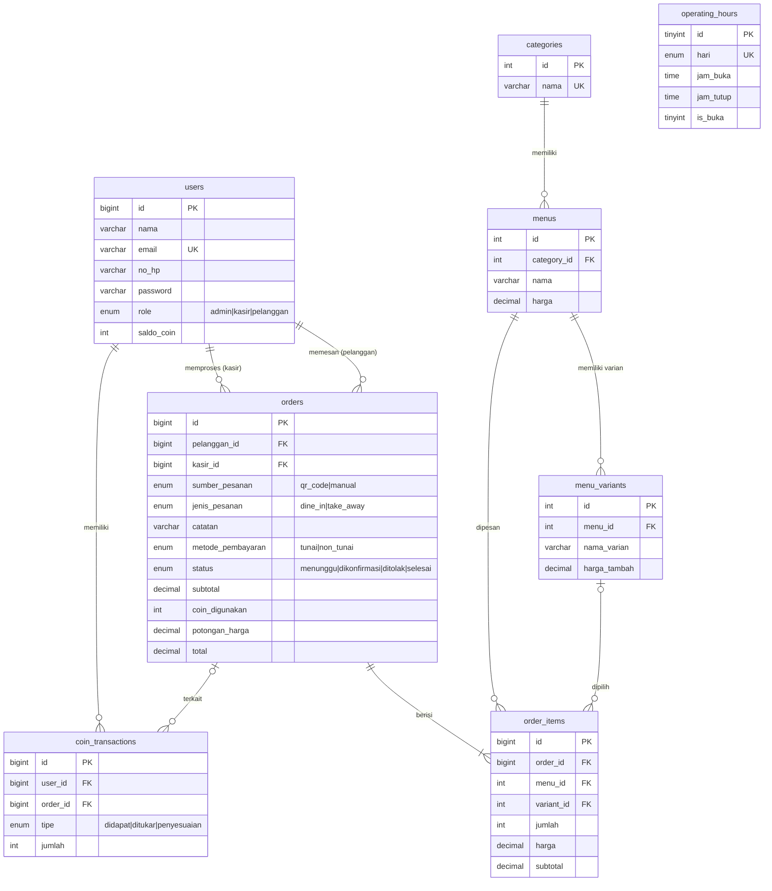

# Sistem Pemesanan Digital Berbasis QR Code dan Aplikasi Kasir Berbasis Web
### Studi Kasus: Kedai Kopi Mbah Buyut

Repository ini berisi rancangan **database** dan **diagram perancangan sistem** (Use Case Diagram, Data Flow Diagram, dan ERD) untuk sistem pemesanan digital berbasis QR Code yang terintegrasi dengan aplikasi kasir berbasis web pada UMKM kuliner Kedai Kopi Mbah Buyut.

---

## Daftar Isi
- [Studi Kasus](#studi-kasus)
- [Rumusan Masalah dan Tujuan](#rumusan-masalah-dan-tujuan)
- [Fitur Sistem](#fitur-sistem)
- [Use Case Diagram](#use-case-diagram)
- [Data Flow Diagram](#data-flow-diagram)
- [Perancangan Database](#perancangan-database)
- [Cara Import Database](#cara-import-database)
- [Struktur Repository](#struktur-repository)

---

## Studi Kasus

Perkembangan teknologi informasi telah mendorong transformasi digital pada berbagai sektor usaha, termasuk Usaha Mikro, Kecil, dan Menengah (UMKM) di bidang kuliner. Penerapan sistem pemesanan digital dan aplikasi kasir berbasis web dapat mengotomatisasi proses pemesanan, transaksi, dan penyusunan laporan penjualan.

**Kedai Kopi Mbah Buyut** adalah UMKM kuliner yang masih melakukan pemesanan dan pencatatan transaksi secara manual. Pelanggan menyampaikan pesanan langsung kepada kasir, lalu kasir mencatat pesanan dan menghitung total pembayaran secara manual. Kondisi ini berpotensi menimbulkan:

- kesalahan pencatatan pesanan,
- kesalahan perhitungan transaksi,
- keterlambatan pelayanan,
- kesulitan menyusun laporan penjualan,
- kesulitan pemilik usaha memantau transaksi secara *real-time*, serta risiko kehilangan data transaksi.

Penelitian-penelitian sebelumnya umumnya masih berfokus pada **aplikasi kasir** atau **aplikasi pemesanan** secara terpisah, belum mengintegrasikan pemesanan berbasis QR Code dengan aplikasi kasir dalam satu platform, belum menerapkan pembagian hak akses berdasarkan peran pengguna, fitur loyalitas pelanggan, dan pembayaran non-tunai yang terintegrasi.

## Rumusan Masalah dan Tujuan

Penelitian ini bertujuan **merancang dan membangun sistem pemesanan digital berbasis QR Code yang terintegrasi dengan aplikasi kasir berbasis web** pada Kedai Kopi, guna meningkatkan efisiensi proses pemesanan, transaksi, dan pengelolaan data penjualan.

Sistem memiliki **tiga jenis pengguna**: **Admin**, **Kasir**, dan **Pelanggan**.

## Fitur Sistem

| Aktor | Fitur |
|---|---|
| **Admin** | Login, melihat statistik transaksi, mengelola data menu (kategori, varian, harga), mengelola data pengguna (role), mengelola laporan transaksi (unduh PDF/Excel), mengelola coin pelanggan, mengelola jam operasional, mengubah profil, logout |
| **Kasir** | Login, memproses transaksi (pilih menu, varian, jumlah, hitung total, kirim nota, input pesanan manual), mengelola pesanan masuk (lihat detail, konfirmasi, tolak), melihat riwayat transaksi, mengubah profil, logout |
| **Pelanggan** | Memindai QR Code, login, melihat daftar menu, melihat saldo coin, checkout (pilih menu, varian, jumlah, keranjang, jenis pesanan, catatan, tukar coin menjadi potongan harga, metode pembayaran, konfirmasi), melihat status pesanan, mengunduh nota, mengubah profil, logout |

---

## Use Case Diagram

### Use Case Admin


### Use Case Kasir


### Use Case Pelanggan


## Data Flow Diagram


---

## Perancangan Database

Database: **`db_kedai_kopi`** (MySQL / MariaDB), terdiri dari **8 tabel**.

### Entity Relationship Diagram (ERD)



### Deskripsi Tabel

| Tabel | Fungsi | Use Case Terkait |
|---|---|---|
| `users` | Data akun dengan role admin, kasir, pelanggan, dan saldo coin | Login, Validasi User, Kelola Data Pengguna, Kelola Role, Ubah Profil, Lihat Saldo Coin |
| `categories` | Kategori menu | Mengelola Kategori Menu |
| `menus` | Data menu dan harga | Mengelola Data Menu, Mengelola Harga, Lihat Daftar Menu |
| `menu_variants` | Varian menu beserta harga tambahan | Mengelola Varian, Memilih Varian |
| `operating_hours` | Jam operasional per hari | Mengelola Jam Operasional |
| `orders` | Header pesanan: sumber (QR/manual), jenis pesanan, catatan, metode pembayaran, status, total, coin yang digunakan | Checkout, Input Pesanan Manual, Kelola Pesanan Masuk, Konfirmasi/Tolak Pesanan, Status Pesanan, Riwayat Transaksi, Laporan |
| `order_items` | Detail item pesanan (menu, varian, jumlah, harga) | Memilih Menu, Memilih Varian, Menentukan Jumlah, Keranjang, Menghitung Total |
| `coin_transactions` | Riwayat perolehan dan penukaran coin | Mengelola Coin Pelanggan, Menukar Coin Menjadi Potongan Harga |

### Catatan Perancangan
- Statistik transaksi, laporan penjualan (PDF/Excel), riwayat transaksi, dan nota **dihasilkan dari query** tabel `orders` dan `order_items`, sehingga tidak dibuatkan tabel tersendiri.
- `orders.sumber_pesanan` membedakan pesanan yang masuk lewat **QR Code** (perlu dikonfirmasi kasir) dengan **pesanan manual** yang diinput kasir.
- `orders.pelanggan_id` boleh kosong (`NULL`) untuk pesanan manual atau pelanggan yang tidak login.
- `order_items.harga` menyimpan harga satuan saat transaksi, sehingga perubahan harga menu tidak memengaruhi data transaksi lama.

---

## Cara Import Database

1. Buka **phpMyAdmin** atau **MySQL Workbench**.
2. Import file `db_kedai_kopi_mbah_buyut.sql`, atau jalankan lewat terminal:

   ```bash
   mysql -u root -p < db_kedai_kopi_mbah_buyut.sql
   ```
3. Database `db_kedai_kopi` beserta 8 tabelnya akan terbentuk. Tabel masih kosong, jadi tambahkan akun admin pertama secara manual atau lewat seeder aplikasi.

## Struktur Repository

```
.
├── Gambar/
│   ├── usecase-admin.png
│   ├── usecase-kasir.png
│   ├── usecase-pelanggan.png
│   └── dfd-sistem.png
├── db_kedai_kopi_mbah_buyut.sql
└── README.md
```
